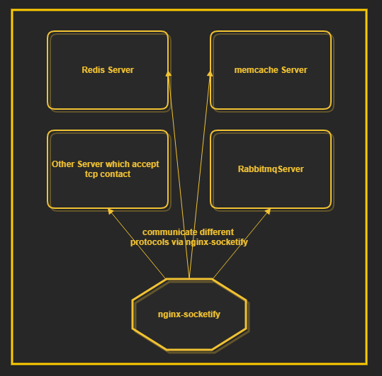

nginx-socketify
=========

Access various tcp protocol services over a nginx-socketify.
customize your upstream socket request and downstream response buffer in Nginx config just `one time effort` .

Table of Contents
=================

* [Introduction](#introduction)
* [Synopsis](#synopsis)
* [Config Commands](#config-commands)
* [Installation](#installation)
* [Test](#test)
* [Support](#support)
* [Copyright & License](#copyright--license)

Introduction
============

nginx-socketify is a nginx 3rd party upstream module which allow to massage(customize) request by sending your own data buffer and proxy to any of your server which accept different protocol request (for example, stomp, redis, memcached), and filter response from upstream servers.

nginx-socketify module is vanilla c module, there is no any fancy dependencies needed.



Example of nginx config for socketify will be provided.

The following is simple demonstration how it communicate to redis, memcache and rabbitmq.

Synopsis
========


```nginx
# nginx.conf
upstream redis_server {
    server 127.0.0.1:6379;
   # server x.x.x.x:6379 backup;
}
upstream memcached_server {
    server 127.0.0.1:11211;
}
upstream rabbitmqup {
    keepalive 100;
    server 127.0.0.1:61618;
}

server {
  # for stomp protocol needed
  socketify_ascii_to_char 0 nullstring;
  socketify_ascii_to_char 10 newline;

  listen       8989;

  # memcached
  location  = /mmc {
      set $lastdelimeter "@:|:@";
      if ( $request_method !~ ^(GET|PUT|POST)$ ) {
          return 405;
      }
      if ($arg_key = ''){
          return 405 'key needed';
      }
      if ( $request_method ~ ^(GET)$ ) {
          socketify_send "get $arg_key\r\n";
          socketify_done_recv_if_eol_match "@:|:@END\r\n";
          socketify_done_recv_if_start_match "END\r\n";
          socketify_substr_resp "\r\n" "@:|:@\r\nEND" 2 0 200;
      }

      socketify_strlen $request_body$lastdelimeter totalbulklength;

      if ( $request_method ~ ^(PUT|POST)$ ) {
          socketify_send "set $arg_key 0 60000 $totalbulklength\r\n$request_body$lastdelimeter\r\n";
          socketify_done_recv_if_eol_match "STORED\r\n";
      }
      socketify_pass memcached_server;
  }

  # ... Redis.conf 
  # ... 
  # ...
}
```

[Back to TOC](#table-of-contents)

Config Commands
===============

* [socketify_pass](#socketify_pass)
* [socketify_escape](#socketify_escape)
* [socketify_ascii_to_char](#socketify_ascii_to_char)
* [socketify_strlen](#socketify_strlen)
* [socketify_send](#socketify_send)
* [socketify_done_recv_by_scan_len](#socketify_done_recv_by_scan_len)
* [socketify_done_recv_if_eol_match](#socketify_done_recv_if_eol_match)
* [socketify_done_recv_if_start_match](#socketify_done_recv_if_start_match)
* [socketify_npacket_should_recv](#socketify_npacket_should_recv)
* [socketify_unescape_response](#socketify_unescape_response)
* [socketify_regex_filter_to_var](#socketify_regex_filter_to_var)
* [socketify_regex_resp](#socketify_regex_resp)
* [socketify_regex_resp_to_hdr](#socketify_regex_resp_to_hdr)
* [socketify_append_resp](#socketify_append_resp)
* [socketify_substr_to_var](#socketify_substr_to_var)
* [socketify_substr_resp](#socketify_substr_resp)
* [socketify_substr_resp_to_hdr](#socketify_substr_resp_to_hdr)
* [socketify_content_type](#socketify_content_type)
* [socketify_socket_schema](#socketify_socket_schema)
* [socketify_cache => _proxy_cache_](http://nginx.org/en/docs/http/ngx_http_proxy_module.html#proxy_cache)
* [socketify_cache_key => _proxy_cache_key_](http://nginx.org/en/docs/http/ngx_http_proxy_module.html#proxy_cache_key)
* [socketify_cache_path => _proxy_cache_path_](http://nginx.org/en/docs/http/ngx_http_proxy_module.html#proxy_cache_path)
* [socketify_cache_bypass => _proxy_cache_bypass_](http://nginx.org/en/docs/http/ngx_http_proxy_module.html#proxy_cache_bypass)
* [socketify_no_cache => _proxy_no_cache_](http://nginx.org/en/docs/http/ngx_http_proxy_module.html#proxy_no_cache)
* [socketify_cache_valid => _proxy_cache_valid_](http://nginx.org/en/docs/http/ngx_http_proxy_module.html#proxy_cache_valid)
* [socketify_cache_min_uses => _proxy_cache_min_uses_](http://nginx.org/en/docs/http/ngx_http_proxy_module.html#proxy_cache_min_uses)
* [socketify_cache_max_range_offset => _proxy_cache_max_range_offset_](http://nginx.org/en/docs/http/ngx_http_proxy_module.html#proxy_cache_max_range_offset)
* [socketify_cache_use_stale => _proxy_cache_use_stale_](http://nginx.org/en/docs/http/ngx_http_proxy_module.html#proxy_cache_use_stale)
* [socketify_cache_methods => _proxy_cache_methods_](http://nginx.org/en/docs/http/ngx_http_proxy_module.html#proxy_cache_methods)
* [socketify_cache_lock => _proxy_cache_lock_](http://nginx.org/en/docs/http/ngx_http_proxy_module.html#proxy_cache_lock)
* [socketify_cache_lock_timeout => _proxy_cache_lock_timeout_](http://nginx.org/en/docs/http/ngx_http_proxy_module.html#proxy_cache_lock_timeout)
* [socketify_cache_lock_age => _proxy_cache_lock_age_](http://nginx.org/en/docs/http/ngx_http_proxy_module.html#proxy_cache_lock_age)
* [socketify_cache_revalidate => _proxy_cache_revalidate_](http://nginx.org/en/docs/http/ngx_http_proxy_module.html#proxy_cache_revalidate)
* [socketify_cache_background_update => _proxy_cache_background_update_](http://nginx.org/en/docs/http/ngx_http_proxy_module.html#proxy_cache_background_update)
* [socketify_buffering => _proxy_buffering_](http://nginx.org/en/docs/http/ngx_http_proxy_module.html#proxy_buffering)
* [socketify_ignore_headers => _proxy_ignore_headers_](http://nginx.org/en/docs/http/ngx_http_proxy_module.html#proxy_ignore_headers)
* [socketify_bind => _proxy_bind_](http://nginx.org/en/docs/http/ngx_http_proxy_module.html#proxy_bind)
* [socketify_connect_timeout => _proxy_connect_timeout_](http://nginx.org/en/docs/http/ngx_http_proxy_module.html#proxy_connect_timeout)
* [socketify_send_timeout => _proxy_send_timeout_](http://nginx.org/en/docs/http/ngx_http_proxy_module.html#proxy_send_timeout)
* [socketify_buffer_size => _proxy_buffer_size_](http://nginx.org/en/docs/http/ngx_http_proxy_module.html#proxy_buffer_size)
* [socketify_buffers => _proxy_buffers_](http://nginx.org/en/docs/http/ngx_http_proxy_module.html#proxy_buffers)
* [socketify_busy_buffers_size => _proxy_busy_buffers_size_](http://nginx.org/en/docs/http/ngx_http_proxy_module.html#proxy_busy_buffers_size)
* [socketify_read_timeout => _proxy_read_timeout_](http://nginx.org/en/docs/http/ngx_http_proxy_module.html#proxy_read_timeout)
* [socketify_next_upstream => _proxy_next_upstream_](http://nginx.org/en/docs/http/ngx_http_proxy_module.html#proxy_next_upstream)
* [socketify_next_upstream_tries => _proxy_next_upstream_tries_](http://nginx.org/en/docs/http/ngx_http_proxy_module.html#proxy_next_upstream_tries)
* [socketify_next_upstream_timeout => _proxy_next_upstream_timeout_](http://nginx.org/en/docs/http/ngx_http_proxy_module.html#proxy_next_upstream_timeout)
* [socketify_pass_request_headers => _proxy_pass_request_headers_](http://nginx.org/en/docs/http/ngx_http_proxy_module.html#proxy_pass_request_headers)
* [socketify_pass_request_body => _proxy_pass_request_body_](http://nginx.org/en/docs/http/ngx_http_proxy_module.html#proxy_pass_request_body)
* [socketify_intercept_errors => _proxy_intercept_errors_](http://nginx.org/en/docs/http/ngx_http_proxy_module.html#proxy_intercept_errors)

[Back to TOC](#table-of-contents)

socketify_pass                                                                                                                                                  
==============           
                                                                                                                                                           
The server which socketify passing the request to.


socketify_escape
================

The data that need to be escaped - socketify_escape <content_to_escape> <escape_type> <response_to_var>
```nginx 
socketify_escape $request_body json escaped_body
```

socketify_ascii_to_char
=======================

The ascii(0-255) that convert to char variable and use it in the config. 


socketify_strlen
=================

count the variable string len


socketify_send
===============

That command that are going to send, variable resolving.
This command allow more than one in same scope of config

```nginx

socketify_send "set $arg_key 0 60000 $totalbulklength\r\n";
socketify_send "$request_body$lastdelimeter\r\n";

# ...

```

socketify_done_recv_by_scan_len
================================

Scan the bytes by giving the position of buffer. Finished read if the bytes len is equal or more than the scanned len. For ex. 

```nginx

socketify_done_recv_by_scan_len scan_aft=content-length:;

```
There are 4 optional attribute :
scan_aft   : which buffer starting to scan
scan_range : the range need to be scan for length
count_aft  : which buffer should be starting to count , for example count_aft=\r\n
count_extra: extra bytes len to count, less using, mostly for extra protocol buffer.


socketify_done_recv_if_start_match
==============================

Done read the bytes by starting matching.

```nginx
# memcached sample if starting is end\r\n means not key found, direct return done recv
 socketify_done_recv_if_start_match "END\r\n";
```

socketify_done_recv_if_eol_match
==============================

Done read the bytes by end of line matching.

```nginx
# memcached sample
 socketify_done_recv_if_eol_match "STORED\r\n";
```

socketify_npacket_should_recv
==============================

This is under beta version.


socketify_unescape_response
============================

To unescape the response, the process is just after done read the bytes

```nginx
socketify_unescape_response json_string;
```

socketify_regex_filter_to_var
=============================

socketify_regex_filter_to_var <data> <regex> output_var

Filter the data by regular expression and pass to the variable, the process trigger when get the variable

```nginx
socketify_regex_filter_to_var $http_token abs(.*) myoutput;
```

socketify_regex_resp
=====================
Filter the response by regular expression, it is the step the data before response to client, it appendable and it accepts multiple commands in sequence  in one scope

socketify_regex_resp <regex> <[append][status_code]>;

For ex.

```nginx

socketify_regex_resp <regex> append;
socketify_regex_resp <regex> append;
socketify_regex_resp <regex> 200; # return 200 status code, status code it's only accept one

```


socketify_append_resp
======================

direct append static content to response, it accepts multiple commands in sequences

```nginx

socketify_append_resp startclause;
socketify_regex_resp <regex> append;
socketify_regex_resp <regex> 200;


```

socketify_regex_resp_to_hdr
===========================
This is the filtering response and pass the response to header variable for the next forwarded request, this is mostly use for @postaction nginx. 


socketify_substr_to_var
=======================
socketify_substr_to_var is similar phase to socketify_regex_filter_to_var, it just using substring

syntax: socketify_substr_to_var <datainput> <[ascii=]lf> <[ascii=]rt> <offsetlf> <offsetrt> output_var


socketify_substr_resp
=======================
socketify_substr_to_var is similar phase to socketify_regex_resp, it just using substring, it accepts multiple commands in sequence in one scope

syntax: socketify_substr_resp <[ascii=]lf> <[ascii=]rt> <offsetlf> <offsetrt> <[append][status_code]>;


socketify_substr_resp_to_hdr
============================
socketify_substr_resp_to_hdr is similar phase to socketify_regex_resp_to_hdr, it just using substring, it accepts multiple commands in sequence in one scope

syntax: socketify_substr_resp_to_hdr <[ascii=]lf> <[ascii=]rt> <offsetlf> <offsetrt> <header_out=>;
syntax: socketify_substr_resp_to_hdr <[ascii=]lf> <[ascii=]rt> <offsetlf> <offsetrt> <header_in=>;

For ex.

```nginx

socketify_substr_resp_to_hdr "Personal Profile: {" "} end personal profile" 19 0 header_out=personalprofile;

19 means move the left substring to 19 forward.

0 means move nothing to forward right string

next action can be use via call $http_personalprofile

```


socketify_content_type
=======================

Set Response content type


socketify_socket_schema
=======================

set the socket schema, ex. memcache:// tcp:// redis://


[Back to TOC](#table-of-contents)           

Installation
============

```bash
wget 'http://nginx.org/download/nginx-1.13.7.tar.gz'
tar -xzvf nginx-1.13.7.tar.gz
cd nginx-1.13.7/

./configure --add-module=/path/to/nginx-socketify

make -j2
sudo make install
```

[Back to TOC](#table-of-contents)


Test
=====

It depends on nginx test suite libs, please refer [test-nginx](https://github.com/openresty/test-nginx) for installation.


```bash
cd /path/to/nginx-socketify
export PATH=/path/to/nginx-dirname:$PATH 
sudo prove t
```

[Back to TOC](#table-of-contents)


Support
=======

Please do not hesitate to contact minikawoon2017@gmail.com for any queries or development improvement.


[Back to TOC](#table-of-contents)

Copyright & License
===================

This module is licensed under BSD 2-Clause License

Copyright (c) 2018, Taymindis Woon <cloudleware2015@gmail.com>
All rights reserved.

Redistribution and use in source and binary forms, with or without
modification, are permitted provided that the following conditions are met:

* Redistributions of source code must retain the above copyright notice, this
  list of conditions and the following disclaimer.

* Redistributions in binary form must reproduce the above copyright notice,
  this list of conditions and the following disclaimer in the documentation
  and/or other materials provided with the distribution.

THIS SOFTWARE IS PROVIDED BY THE COPYRIGHT HOLDERS AND CONTRIBUTORS "AS IS"
AND ANY EXPRESS OR IMPLIED WARRANTIES, INCLUDING, BUT NOT LIMITED TO, THE
IMPLIED WARRANTIES OF MERCHANTABILITY AND FITNESS FOR A PARTICULAR PURPOSE ARE
DISCLAIMED. IN NO EVENT SHALL THE COPYRIGHT HOLDER OR CONTRIBUTORS BE LIABLE
FOR ANY DIRECT, INDIRECT, INCIDENTAL, SPECIAL, EXEMPLARY, OR CONSEQUENTIAL
DAMAGES (INCLUDING, BUT NOT LIMITED TO, PROCUREMENT OF SUBSTITUTE GOODS OR
SERVICES; LOSS OF USE, DATA, OR PROFITS; OR BUSINESS INTERRUPTION) HOWEVER
CAUSED AND ON ANY THEORY OF LIABILITY, WHETHER IN CONTRACT, STRICT LIABILITY,
OR TORT (INCLUDING NEGLIGENCE OR OTHERWISE) ARISING IN ANY WAY OUT OF THE USE
OF THIS SOFTWARE, EVEN IF ADVISED OF THE POSSIBILITY OF SUCH DAMAGE.


[Back to TOC](#table-of-contents)
